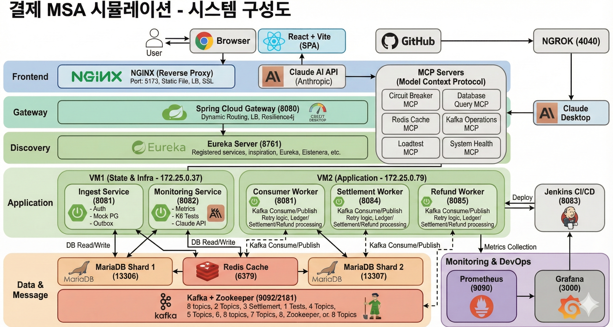

# Payment_SWElite

**대용량 트래픽 처리와 운영 자동화를 검증하기 위한 백엔드 중심 결제 시스템 시뮬레이션 프로젝트**

Payment_SWElite는 서비스 출시가 목적이 아닌, 백엔드 관점에서 대용량 트래픽을 안정적으로 처리하고 운영 효율을 높이는 방법을 검증하는 실험 프로젝트입니다. 승인→정산→환불 E2E 흐름을 최소 기능으로 구현하고, Outbox·멱등성·Rate Limit·Circuit Breaker·DLQ·모니터링으로 병목/장애/운영 지표를 체계적으로 점검합니다.

## 이 프로젝트가 집중한 것

- **트래픽 처리**: Kafka 기반 이벤트 처리, Outbox 패턴, 비동기 워커로 처리량 확보
- **운영 안정성**: 멱등성 키/Rate Limit, Circuit Breaker, 재시도/백오프, DLQ로 장애 격리
- **관측성과 자동화**: Prometheus/Grafana 대시보드, Admin Dashboard, Jenkins, MCP 도구화

## 대표 성능 지표 (k6 기준)

| 항목 | 결과 |
| --- | --- |
| 처리량 | 1000+ RPS |
| 지연시간 | p95 300ms대 |
| 오류율 | 0.01% |

**아키텍처 한눈에 보기**

<p align="center">
  
</p>


---

## 프로젝트 개요

Payment_SWElite는 결제 도메인을 소재로 한 **대용량 트래픽·운영 최적화 실험 플랫폼**입니다. 서비스 자체를 만드는 것이 아니라, 운영 관점에서 “무엇을 관측하고, 어디에서 병목이 생기며, 장애를 어떻게 격리하고 복구하는지”를 검증하는 데 초점을 맞춥니다.
## 핵심 가치

| 영역        | 설명                                                                          |
| ----------- | ----------------------------------------------------------------------------- |
| 안정성      | Transactional Outbox, 멱등성 키, 재시도/지수 백오프, DLQ로 데이터 유실 최소화 |
| 복원력      | Resilience4j 기반 Circuit Breaker + 자동 시나리오 테스트로 장애 격리          |
| 관측성      | Prometheus 메트릭 + Grafana 대시보드로 서비스 지표 가시화                     |
| 확장성      | 서비스 분리, 샤딩(merchantId 기반), 멀티 VM 구성 및 확장 로드맵               |
| 운영 자동화 | Jenkins + Admin Dashboard + MCP 서버로 테스트와 운영 분석 자동화              |

---

## 서비스 구성

| 서비스             | 역할                                  | 비고                          |
| ------------------ | ------------------------------------- | ----------------------------- |
| api-gateway        | 모든 요청의 진입점, 라우팅            | Spring Cloud Gateway + Eureka |
| eureka-server      | 서비스 디스커버리                     | 마이크로서비스 등록/조회      |
| ingest-service     | 결제 API(승인/정산/환불), Outbox 발행 | 핵심 트랜잭션 처리            |
| consumer-worker    | Kafka 이벤트 → 원장(ledger) 반영     | 비동기 후처리                 |
| settlement-worker  | 정산 처리 및 Mock PG 호출             | 비동기 실행                   |
| refund-worker      | 환불 처리 및 Mock PG 호출             | 비동기 실행                   |
| monitoring-service | 모니터링/운영 API                     | 관리자 기능 허브              |
| frontend           | 데모 스토어 + 관리자 대시보드         | React + Vite                  |

지원 인프라: MariaDB, Kafka/Zookeeper, Redis, Prometheus, Grafana, Jenkins

---

## 데이터·이벤트 설계

- **결제 상태 모델**: 승인 → 정산 → 환불 등 11단계 상태 관리
- **Outbox Pattern**: DB 트랜잭션과 이벤트 발행 분리, 장애 시 재발행 가능
- **Kafka 토픽**: `payment.authorized`, `payment.capture-requested`, `payment.captured`, `payment.refund-requested`, `payment.refunded`, `payment.dlq`, `settlement.dlq`, `refund.dlq`
- **핵심 테이블**: `payment`, `ledger_entry`, `outbox_event`, `idem_response_cache`, `settlement_request`, `refund_request`

---

## 운영·관측·테스트

- **Redis 기반 보호 기능**: 멱등성 키 캐시 + merchant별 Rate Limit (fail-open 전략)
- **Circuit Breaker**: Kafka 장애 격리, 자동 시나리오 테스트 및 대시보드
- **Grafana 대시보드**: Payment Service Overview, Settlement & Refund, Performance(800 RPS)
- **k6 부하 테스트**: 승인 전용 / 승인+정산 / 전체 플로우 시나리오 제공
- **Admin Dashboard**: 테스트 실행, 운영 통계 조회, AI 분석 리포트 생성
- **MCP 서버**: 운영 데이터 조회 및 장애 진단을 위한 AI 도구 세트

---

## 성능 검증 메모 (문서 기준)

- 400 → 800 → 1000 RPS 단계별 튜닝 및 시나리오 기록
- k6 결과와 튜닝 과정은 `7Week.md`, `8Week.md`, `Analysis_report.md` 참고

---

## 빠른 실행

```bash
docker compose docker-compose.yml up -d
```

접속 포인트

- 프론트엔드: `http://localhost:5173`
- 관리자 대시보드: `http://localhost:5173/admin`
- Grafana: `http://localhost:3000`
- Eureka: `http://localhost:8761`
- Gateway API: `http://localhost:8080/api`

---

## 문서 모음

- 아키텍처 플랜: `ArchitecturePlan.md`
- 종합 분석 보고서: `Analysis_report.md`
- 서킷 브레이커 가이드: `CIRCUIT_BREAKER_GUIDE.md`
- 관리자 대시보드 가이드: `ADMIN_DASHBOARD_GUIDE.md`
- MCP 통합 가이드: `MCP_INTEGRATION_GUIDE.md`
- 부하 테스트 가이드: `loadtest/k6/README.md`
- 모니터링 API: `backend/monitoring-service/README.md`
- 향후 로드맵: `Future_Plan.md`

---

## 개발 기록

주차별 목표 및 상세 로그는 개발 전용 문서로 분리했습니다.

- `README_ONLY_DEVELPOER.md`

